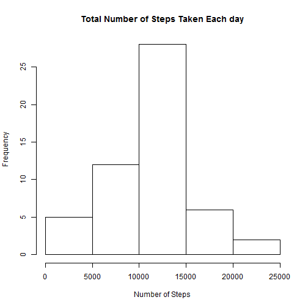
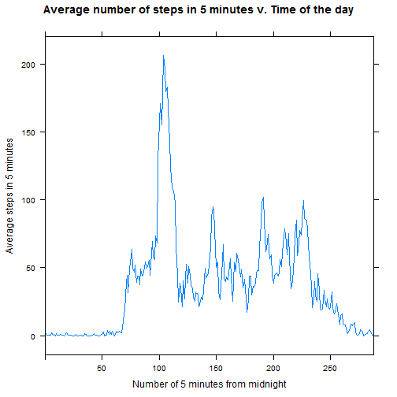
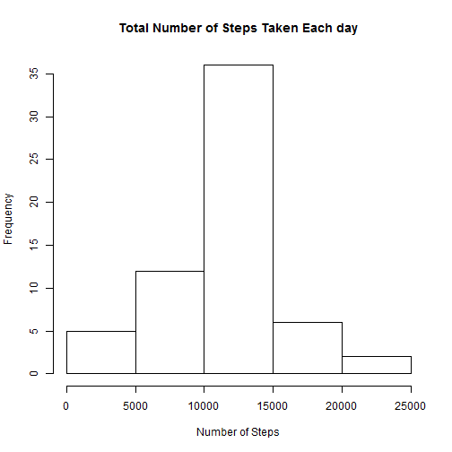
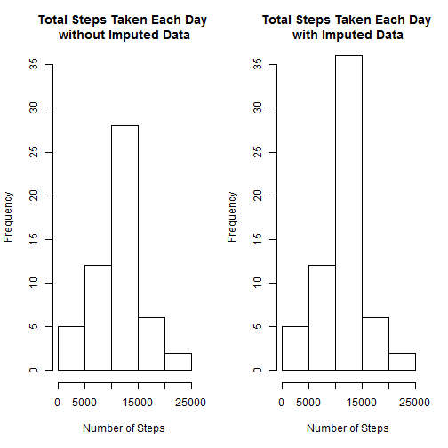
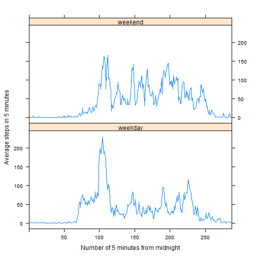

##Summary
This is an exploratory analysis of the pattern of walking steps prepared for homework assignment of ["Reproducible Research" course](https://www.coursera.org/course/repdata/) taught by *Roger D. Peng* at <http://coursera.org>. 

This assignment makes use of data from a personal activity monitoring device. This device collects data at 5 minute intervals through out the day. The data consists of two months of data from an anonymous individual collected during the months of October and November, 2012 and include the number of steps taken in 5 minute intervals each day.

The report includes attempts to answer following questions:  

* What is mean total number of steps taken per day?  
  1.Make a histogram of the total number of steps taken each day.  
  2.Calculate and report the **mean** and **median** total number of steps taken per day.  
  
* What is the average daily activity pattern?  
  1.Make a time series plot of the 5-minute interval (x-axis) and the average number of steps taken, averaged across all days (y-axis).    
  2.Which 5-minute interval, on average across all the days in the dataset, contains the maximum number of steps?  

* Imputing missing values  
  1.Calculate and report the total number of missing values in the dataset (i.e. the total number of rows with NAs)    
  2.Devise a strategy for filling in all of the missing values in the dataset. The strategy does not need to be sophisticated. For example, you could use the mean/median for that day, or the mean for that 5-minute interval, etc.  
  3.Create a new dataset that is equal to the original dataset but with the missing data filled in.  
  4.Make a histogram of the total number of steps taken each day and Calculate and report the **mean** and **median** total number of steps taken per day. Do these values differ from the estimates from the first part of the assignment? What is the impact of imputing missing data on the estimates of the total daily number of steps?  
  
* Are there differences in activity patterns between weekdays and weekends?  
  1.Create a new factor variable in the dataset with two levels - "weekday" and "weekend" indicating whether a given date is a weekday or weekend day.  
  2.Make a panel plot containing a time series plot of the 5-minute interval (x-axis) and the average number of steps taken, averaged across all weekday days or weekend days (y-axis). See the README file in the GitHub repository to see an example of what this plot should look like using simulated data.  
  
  
##Data  
The variables included in this dataset are:

* steps: Number of steps taking in a 5-minute interval (missing values are coded as NA)

* date: The date on which the measurement was taken in YYYY-MM-DD format

* interval: Identifier for the 5-minute interval in which measurement was taken

There are a total of 17,568 observations in this dataset.  
  
  
##Results

###Loading and preprocessing the data

1.Load the data  

```r
##Loading the data
activity<-read.csv("activity.csv", header=TRUE, sep=",")
```

2.Process/transform the data (if necessary) into a format suitable for your analysis  

```r
library(plyr)

library(lattice)

library(knitr)

# format the interval to 4 digit form
activity$interval_0<-formatC(activity$interval, width=4, flag="0")

#create data_time variable
activity$date_time<-paste(activity$date,activity$interval_0)
      
activity$date_time<-strptime(activity[,"date_time"],"%Y-%m-%d %H%M")

activity$interval_0<-as.factor(activity$interval_0)

#transform time interval to number of 5 minutes from midnight
time_zero<-as.POSIXlt("0000", format="%H%M")

activity$relative_time<-as.numeric(as.POSIXlt(activity[,"interval_0"], format="%H%M")-time_zero)/300

activity$relative_time<-as.factor(activity$relative_time)
```

###What is mean total number of steps taken per day
1.Histogram of the total number of steps taken each day  


```r
##calculate total steps in each day and create histogram
summary_day<-ddply(activity,~date,summarise,total=sum(steps))

hist(summary_day$total,xlab="Number of Steps",
     main="Total Number of Steps Taken Each day")
```

 

2.Calculate and report the mean and median total number of steps taken per day  


```r
mean_total<-mean(summary_day$total,na.rm=TRUE)

median_total<-median(summary_day$total,na.rm=TRUE)

paste("The mean total number of steps taken per day is", round(mean_total, digits = 2))
```

```
## [1] "The mean total number of steps taken per day is 10766.19"
```

```r
paste("The median total number of steps taken per day is", round(median_total, digits = 2))
```

```
## [1] "The median total number of steps taken per day is 10765"
```

###What is the average daily activity pattern?
1.Time series plot of the 5-minute interval and the average number of steps taken, averaged across all days


```r
#compute average steps for each interval
average_interval<-ddply(activity,~relative_time,summarise,
                        mean=mean(steps,na.rm=TRUE))

xyplot(mean~relative_time, type = "l",
       data = average_interval, 
       xlab="Number of 5 minutes from midnight", ylab="Average steps in 5 minutes",
       main="Average number of steps in 5 minutes v. Time of the day",
       xlim=seq(0,288,by=12))
```

 

2.Which 5-minute interval, on average across all the days in the dataset, contains the maximum number of steps?


```r
#find the value of maximum average interval mean
max_5min<-max(average_interval$mean)

#find the interval from relative_time
max_relative_time<-average_interval[which(average_interval$mean==max_5min),"relative_time"]

#find the four digit time interval
max_time<-activity[which(activity$relative_time==max_relative_time),"interval_0"]

max_hour<-as.POSIXlt(max_time[1], format="%H%M")$hour

max_min<-as.POSIXlt(max_time[1], format="%H%M")$min

paste("The 5-min interval containing the maximum average steps is", 
      paste(max_hour, max_min, sep=":"))
```

```
## [1] "The 5-min interval containing the maximum average steps is 8:35"
```

**Walking sharply increases from the early morning, peaks around rush-hour at 8:35, and then sharply drops after morning rush-hours.**

**It also increases moderately during lunch time and after rush-hour. As night approaches, walking diminishes.**


###Imputing missing values (using mean steps of corresponding interval)

1.Calculate and report the total number of missing values in the dataset (i.e. the total number of rows with NAs)


```r
activity_original<-read.csv("activity.csv", header=TRUE, sep=",")

num_NA<-nrow(activity_original)-sum(complete.cases(activity_original))

paste("The total number of rows with NAs is", 
      num_NA)
```

```
## [1] "The total number of rows with NAs is 2304"
```

2.Filling in all of the missing values in the dataset with mean steps of corresponding interval.  
3.Create a new dataset that is equal to the original dataset but with the missing data filled in.


```r
#check the number of NAs in each variable
"The number of NAs in steps is"
```

```
## [1] "The number of NAs in steps is"
```

```r
paste("The number of NAs in steps is", 
      sum(is.na(activity_original$steps)))
```

```
## [1] "The number of NAs in steps is 2304"
```

```r
paste("The number of NAs in date is", 
      sum(is.na(activity_original$date)))
```

```
## [1] "The number of NAs in date is 0"
```

```r
paste("The number of NAs in interval is", 
      sum(is.na(activity_original$interval)))
```

```
## [1] "The number of NAs in interval is 0"
```

```r
#subset rows with NAs 
activity.NA<-activity[which(is.na(activity$steps)),
                      c("steps","date_time","relative_time")]

#fill NAs in the subset activity.NA
for (i in 0:287) {
      activity.NA[which(activity.NA$relative_time==i),"steps"]<-average_interval[i+1,"mean"]
}

#initiated new data frame activity_imputed for imputed data
activity_imputed<-activity

#use row names in the subset activity.NA to find and replace NAs in activity_imputed
for (i in nrow(activity.NA)) {
      activity_imputed[rownames(activity.NA),"steps"]<-activity.NA$steps
      
}

#check the number of NAs in imputed dataset

paste("The number of NAs in current imputed dataset is", 
      sum(is.na(activity_imputed$steps)))
```

```
## [1] "The number of NAs in current imputed dataset is 0"
```

4.Histogram of the total number of steps taken each day and Calculate and report the **mean** and **median** total number of steps taken per day. Do these values differ from the estimates from the first part of the assignment? What is the impact of imputing missing data on the estimates of the total daily number of steps?


```r
#compute total steps for each day
summary_day_imputed<-ddply(activity_imputed,~date,summarise,total=sum(steps))

#histogram of totals
hist(summary_day_imputed$total,xlab="Number of Steps",
     main="Total Number of Steps Taken Each day")
```

 

```r
#compute mean and median of totals
mean_total_imputed<-mean(summary_day_imputed$total,na.rm=TRUE)

median_total_imputed<-median(summary_day_imputed$total,na.rm=TRUE)

paste("The new mean total number of steps taken per day is", round(mean_total_imputed, digits = 2))
```

```
## [1] "The new mean total number of steps taken per day is 10766.19"
```

```r
paste("The new median total number of steps taken per day is", round(median_total_imputed, digits = 2))
```

```
## [1] "The new median total number of steps taken per day is 10766.19"
```

```r
paste("The old mean total number of steps taken per day is", round(mean_total, digits = 2))
```

```
## [1] "The old mean total number of steps taken per day is 10766.19"
```

```r
paste("The old median total number of steps taken per day is", round(median_total, digits = 2))
```

```
## [1] "The old median total number of steps taken per day is 10765"
```
**So the mean remains the same.**
**The median becomes larger and moves closer to the mean.**

**These results are caused by imputing only mean number. Thus the distribution of total steps per day increases at the mean level, according to the following histograms.**


```r
#Compare the distribution of total steps per day
par(mfrow=c(1,2))

hist(summary_day$total,ylim=c(0,35),xlab="Number of Steps",
     main=paste("Total Steps Taken Each Day","\nwithout Imputed Data"))

hist(summary_day_imputed$total,ylim=c(0,35),xlab="Number of Steps",
     main=paste("Total Steps Taken Each Day", "\nwith Imputed Data"))
```

 

```r
par(mfrow=c(1,1))
```

###Are there differences in activity patterns between weekdays and weekends?

1.Create a new factor variable in the dataset with two levels - "weekday" and "weekend" indicating whether a given date is a weekday or weekend day.


```r
weekday<-c("Monday","Tuesday","Wednesday","Thursday","Friday")

#determine weekdays
activity_imputed$weekday<-weekdays(activity_imputed[,"date_time"])

#create weekday indicator/factor weekday_indicator
activity_imputed$weekday_indicator<-as.factor(ifelse(activity_imputed$weekday %in% weekday,"weekday","weekend"))

head(activity_imputed$weekday_indicator,n=3)
```

```
## [1] weekday weekday weekday
## Levels: weekday weekend
```

2.Time series plot of the 5-minute interval and the average number of steps taken, averaged across all weekday days or weekend days. 


```r
#compute 5-min interval average based on factor weekday_indicator
average_interval_imputed_weekday<-ddply(activity_imputed,.(relative_time,weekday_indicator),summarise, mean=mean(steps,na.rm=TRUE))


#time series plot
xyplot(mean~relative_time | weekday_indicator, type = "l",
       data = average_interval_imputed_weekday, layout = c(1:2), 
       xlab="Number of 5 minutes from midnight", ylab="Average steps in 5 minutes",
       xlim=seq(0,288,by=48))
```

 


**During weekdays, the walking peaks in the moring around rush-hour at 8:35, then drops significantly lower after rush-hour. By contrast, walking in weekends is more evenly distributed during the day.**
